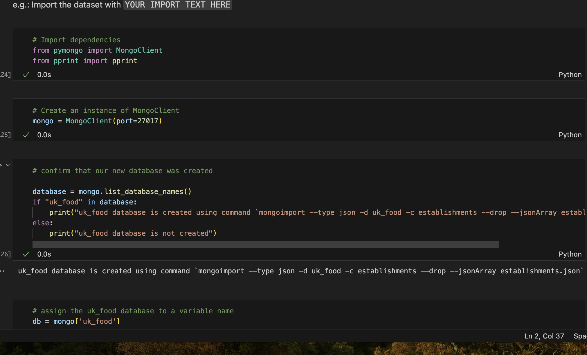
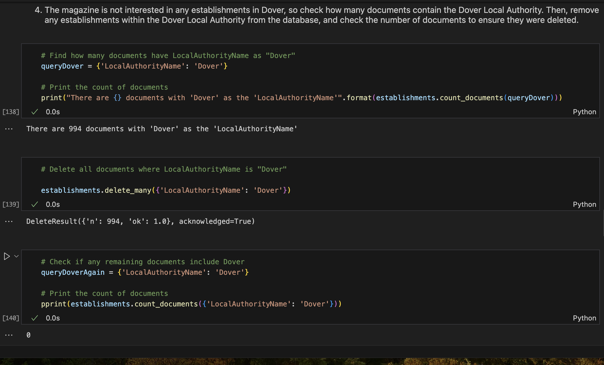
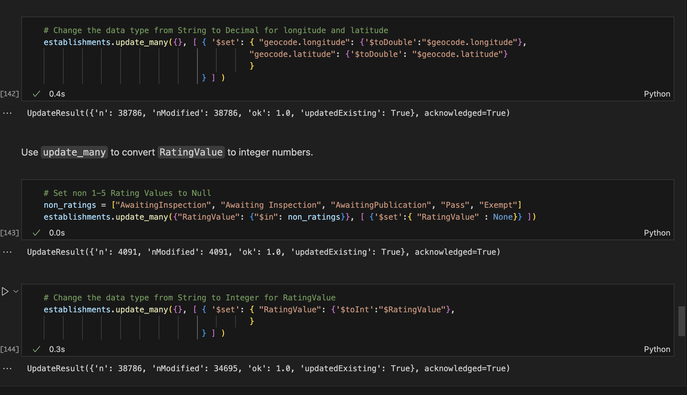
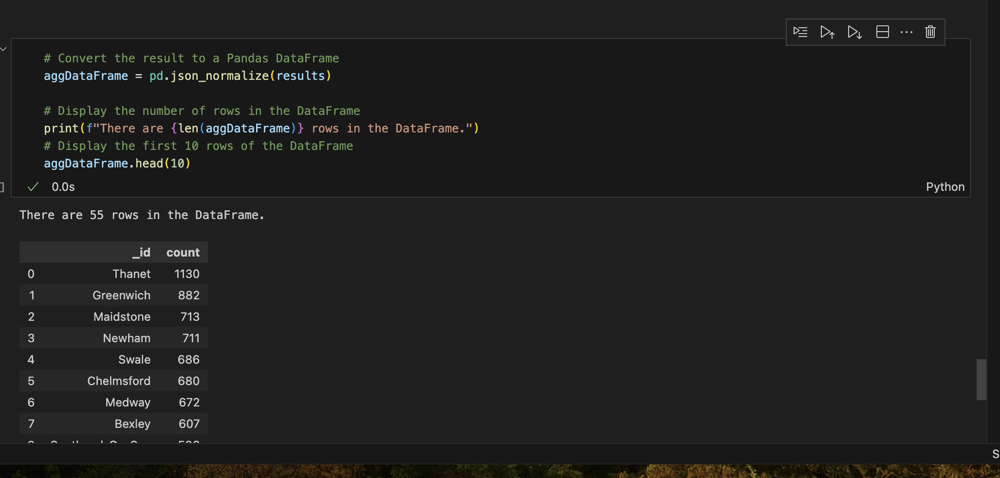
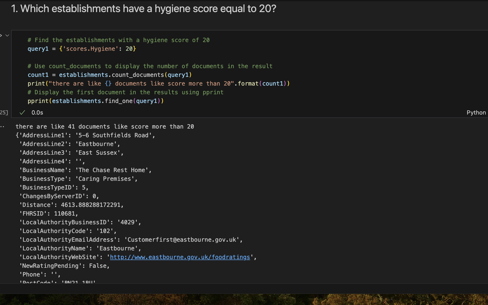
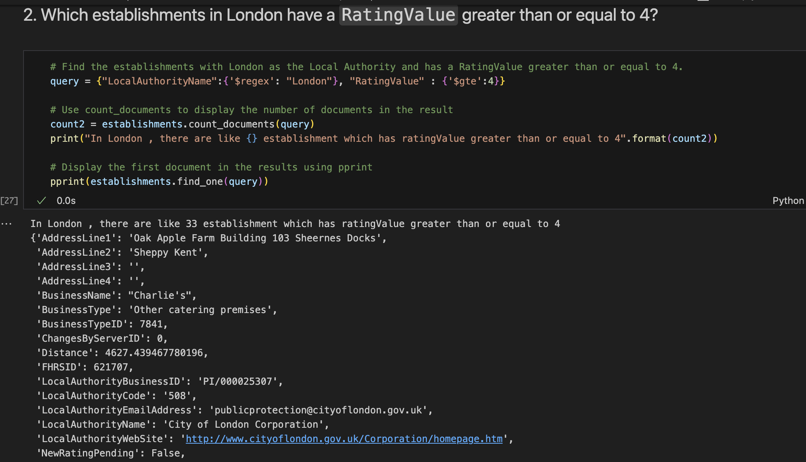
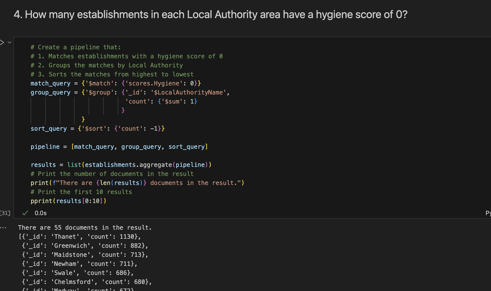

# nosql-challenge
Database and Collection Creation
Create, and import the data into, the database. Followed by connecting to the MongoDB a Jupyter Notebook and PyMongo:

Using the establishments.json data file provided, use the 'mongoimport' function in a terminal to create a database named 'uk-food' and a collection 'establishments' to import the documents.
mongoimport --type json -d uk_food -c establishments --drop --jsonArray establishments.json

Dover Check

Long and Lat Con

Analysis

41 documents found

33 Establishments

Hygiene Score

